<!-- ========================================= -->
<!-- 🟦 PREMIUM BANNER -->
<!-- ========================================= -->

  

---

# 👨‍💻 About Me  
I'm a **Computer Science undergraduate** skilled in **Java, Android Development, and DSA**.  
I’ve built **real-time apps**, worked with **APIs**, and solved **250+ LeetCode problems**.  
I enjoy creating apps that are **simple, fast, and intuitive**.

---

# 🛠 Tech Stack  

### 💻 Languages  

### 🌐 Web Tech  

### 🤖 Android  

### ⚙ Tools  

---

# 🔥 Projects  

### 🌦 Weather App (Android – Java)  
✔ Real-time weather via **OpenWeatherMap API** · Google Location Services · Temp/min/max/date/city  

### 🎵 Sangeet App – Music Player  
✔ Local audio scanning · Play/Pause/Skip/Seek · **MediaPlayer + Dexter**  

### 🛍 Product Search Platform  
✔ Price comparison · AI-based insights · Smart recommendations  

### 💬 Real-time Chat App  
✔ React + MongoDB · Auth · Smooth UI animations  

### 🎟 Movie Ticket Booking App  
✔ Seat selection · Payment flow · Recommendations  

---

# 🏆 Achievements  
- 🥇 **250+ LeetCode problems solved**  
- 🥈 **Code Auction Hackathon – 12th/150 teams**  
- 🎓 **NPTEL – Software Engineering**  
- 🎓 **Android Development – EduSkills**

---

# 📊 GitHub Stats  

<!-- ⭐ Stable Stats Card (mirror) -->

<!-- ⭐ Streak Card (demolab) -->

<!-- ⭐ Top Languages (mirror) -->

---

# 🧭 Metrics (Auto-updating)
<!-- Generated daily by .github/workflows/metrics.yml -->

  

---

# 🏅 GitHub Trophy  

  

---

# 🐍 Contribution Snake (Animated)  

  

---

# 📫 Connect with Me  
  

---

# 🚀 *Let’s build something amazing together!*
